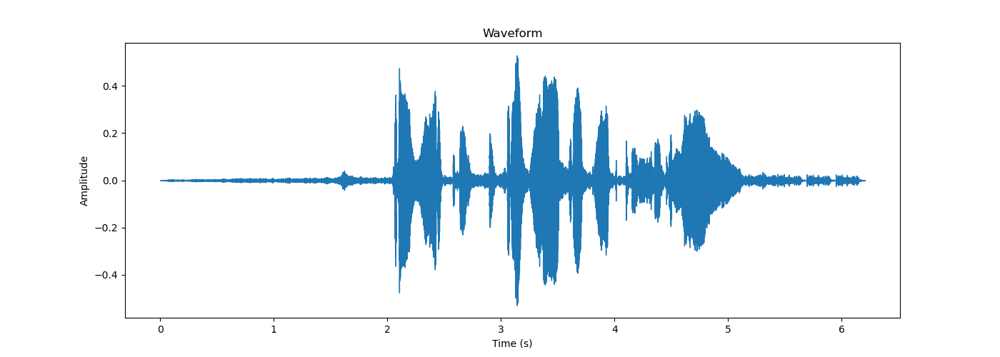
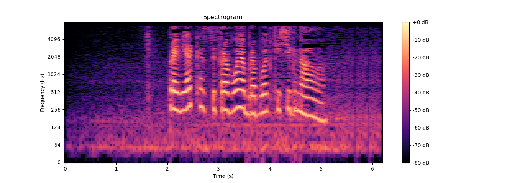

# Digital Signal Processing (DSP) & Hearing Tech Marathon

This project documents my journey from fundamental audio analysis to real-time embedded DSP development.

---

## 🚀 Phase 1: Environment Setup & Audio Visualization

The goal of this initial phase was to set up a robust Python environment for audio processing, extract key signal parameters, and visualize audio data in both the time and frequency domains.

> **📌 Note:** All hands-on tasks are designed, structured, and provided by an AI mentour to simulate a production-grade engineering internship. :D

### 🔊 Audio Signal "Passport"
Using `librosa`, I loaded a custom voice sample using its native characteristics (`sr=None`). Here are the extracted parameters of the processed signal:

* **Sample Rate (SR):** 16000 Hz (Nyquist Frequency: 8000 Hz)
* **Duration:** 6.20 seconds
* **Max Amplitude:** 0.5285 (Good gain levels, safe headroom, no digital clipping)
* **Min Amplitude:** -0.5028
* **Mean Amplitude:** 0.0000 (Perfect DC-offset alignment)
* **Amplitude Range:** 1.0313

---

### 📊 Signal Visualizations

#### 1. Time-Domain Analysis (Waveform)
The waveform represents air pressure fluctuations captured by the microphone over time. It clearly shows the speech envelopes and silent intervals, but hides the exact pitch and harmonic content.

#### 2. Frequency-Domain Analysis (STFT Spectrogram)
To extract frequency content without losing chronological order, I implemented a **Short-Time Fourier Transform (STFT)**. The linear magnitude values were converted to the log-scale **dBFS (Decibels relative to Full Scale)** to align with human auditory perception. 

The color intensity (using the `magma` colormap) represents energy distribution, highlighting the prominent formants of the human voice.

---

## 🛠️ Tech Stack & Dependencies
* **Language:** Python v3.14
* **Core Libraries:** `librosa`, `scipy`, `numpy`, `matplotlib`.