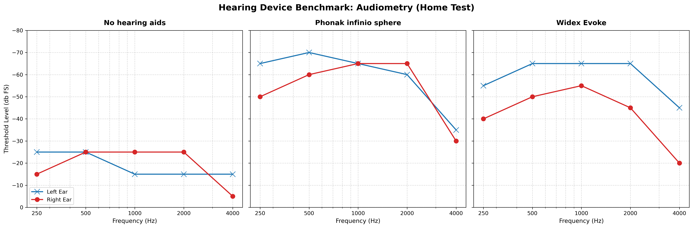

# 🎧 Home Audio Audiometer with Linux PortAudio (Binaural)

Now, here is a slightly more serious project: a Python application designed to conduct pure-tone threshold audiometry at home using the clinical **Houston-Westlake adaptive method** (10 dB down, 5 dB up). 

This project was built to bypass Linux PulseAudio/PipeWire device lock limitations and benchmark different hearing systems.

## 🚀 Key Features
* **Binaural Split Testing:** Sequentially benchmarks Left and Right channels
* **Hardware Safe:** Implemented a smooth 100ms fade-in/fade-out mechanism to eliminate sudden sound click
* **Linux Optimized:** Encountered a problem with Linux trying to connect the headphones using sounddevice library
* **Auto-Export:** Generates structural `.txt` and `.json` clinical logs with precise timestamps

## 📊 Hearing Aid Benchmark Case Study
Using this tool with `Sennheiser` headphones, a comparative study was conducted across three environments:
1. **Unaided** (A baseline - without hearing aids)
2. **Widex Evoke Hearing Aids**
3. **Phonak Infinio Sphere Hearing Aids**

### Research Findings
The home test successfully diagnosed a hardware degradation in the **Widex Evoke (Right Device)** at $4000\text{ Hz}$, showing a significant asymmetrical attenuation. Conversely, the **Phonak Infinio Sphere** demonstrated superior binaural synchronization and aggressive high-frequency compensation.

---

[« Back to README](../README.md)